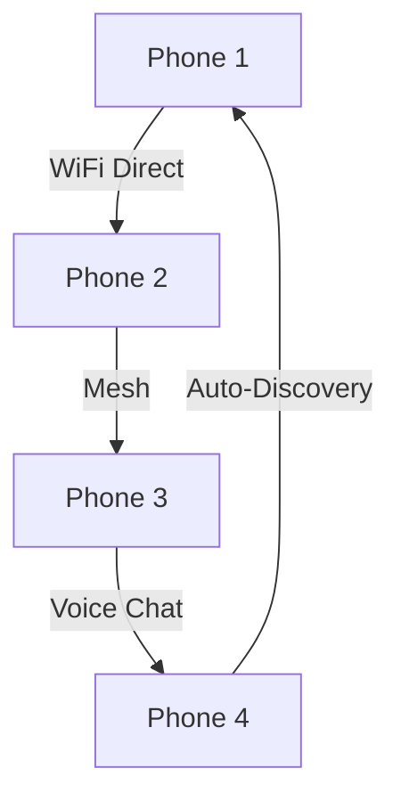

# MyPhone


## Features

```
🚫 No SIM Required      |    🆓 Secure Wifi Calling & Messaging
🌐 Global Compatibility |    📦 Works Right Out of the Box
🛠️ Repairable design    |    🧠 Voice Orchestrator  
```

## Gaming Powerhouse: Switch Meets Smartphone

| Feature           | Description          | ✅ |
| ----------------- | -------------------- | -  |
| 🎯 P2P Gaming     | Wi-Fi / Wi-Fi Direct | ✅ |
| 🔄 Landscape Mode | Console like play    | ✅ |
| 👾 Retro Library  | Classics built-in    | ✅ |

### Mesh Gaming Network



## Offline-First Navigation

* 📶 Maps download automatically over Wi-Fi before you need them
* 📡 Navigate anywhere with GPS + preloaded maps (no internet needed)

## Secure Browser

| Feature    | Traditional      | MyPhone         |
| ---------- | ---------------- | --------------- |
| Banking    | 🔴 Multiple Apps | 🟢 All-in-One   |
| Privacy    | 🔴 Tracked       | 🟢 No Tracking  |
| Utilities  | 🔴 Multiple Apps | 🟢 Agents       |


## Tech Specs
Revolutionary
```yaml
Processor:
  SoM: Snapdragon 8 Gen 3 Mobile Hardware Development Kit 

Memory:
  RAM: 12GB
  Storage: 512GB
  Expandable: 2TB MicroSD

Display:
  6.5" FHD+ (2400x1080)
  IPS, 120Hz, Gorilla Glass 5

Camera:
  Front: 50MP Sony IMX766 Camera CMOS
  Rear:  50MP Sony IMX586 MIPI FPC Camera Module

Battery:
  4500mAh, 45W fast charge USB-C PD

Connectivity:
  WiFi 6, GPS, Single SIM
  3.5mm Jack, Stereo Speakers

Accesories:
  Protective Case
```

